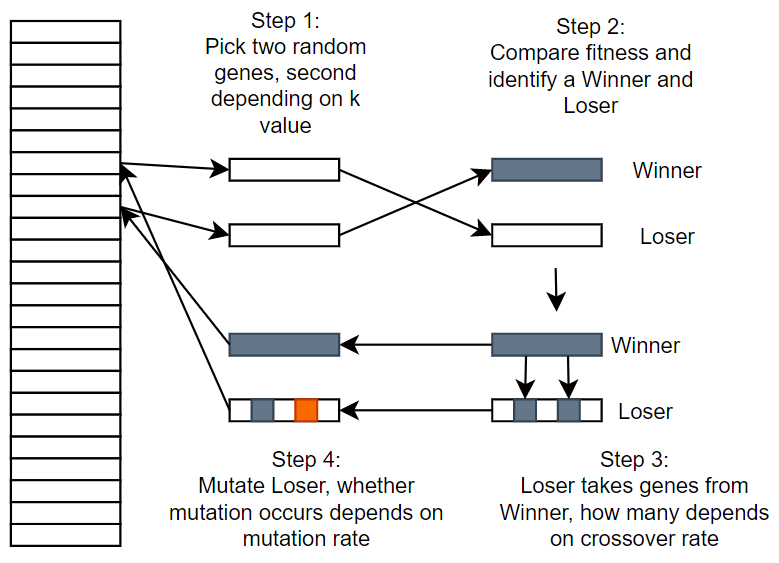
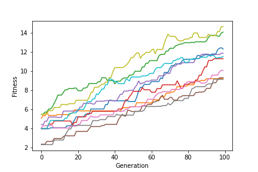
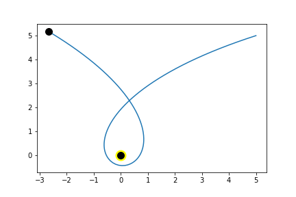
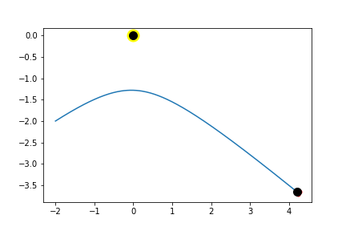
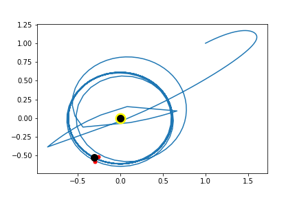
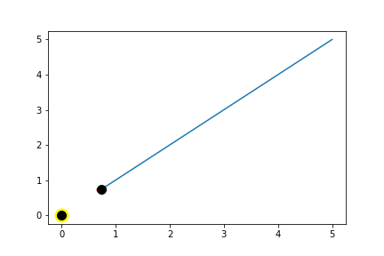
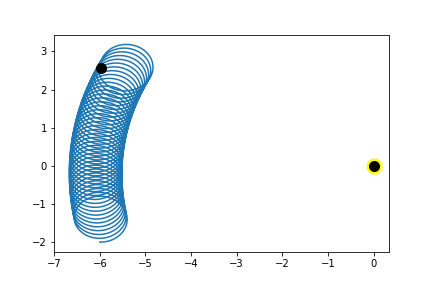
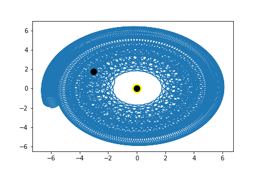

# AIAB
Acquired Intelligence and Adaptive Behaviour

      HillClimber

A hillclimber is a heuristic search used for solving mathematical optimization problems. Given a large set of inputs, these algorithms can find sufficient solutions to these problems. There are different types of hill climbing algorithms. The implemented type here is the Stochastic Hill Climber.

      HillClimber process

A single hillclimber will eventually reach a peak where changing any individual gene will only decrease the fitness. This does not mean it has the optimal solution but does mean it would take multiple gene changes in one go to find a more optimal solution.

      Example of a single hillclimber

      Example of a series of hillclimbers

      Genetic Algorithms (GA)

A Genetic Algorithm is a way of solving both constrained and unconstrained optimization problems. The algorithm works by repeatedly modifying a population of individuals to optimize the solution. The aim is to find the best possible solution. A genetic algorithm is an example of an evolutionary algorithm, that uses a ‘survival of the fittest’ approach to find the best possible solutions to the problem. These algorithms work by randomly selecting individuals from the population and comparing them to another individual. The individual with the lower benefit (loser) will take genes of the individual with better benefit (winner). The chances of genes being taken from the winner is controlled by a crossover rate which defines how likely a chance is per gene. Each individual in the population has a set of genes.

      GA process

      Example of a single GA
      

      Vehicles

There were 4 main types of vehicles approached in this assignment
      
      Aggressor
     

      Coward
     

      Explorer
     

      Lover
     

      Single Eyed Phototaxis
      
A further advancement made in this module was looking at single eyed phototaxis

