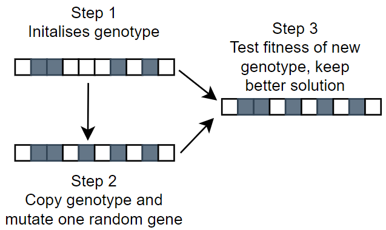
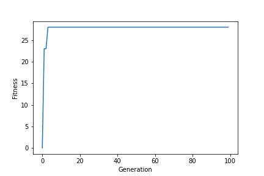
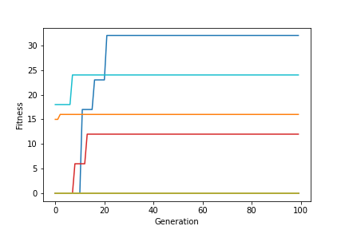

# AIAB
Acquired Intelligence and Adaptive Behaviour

HillClimber
A hillclimber is a heuristic search used for solving mathematical optimization problems. Given a large set of inputs, these algorithms can find sufficient solutions to these problems. There are different types of hill climbing algorithms. The implemented type here is the Stochastic Hill Climber.

HillClimber process

A single hillclimber will eventually reach a peak where changing any individual gene will only decrease the fitness. This does not mean it has the optimal solution but does mean it would take multiple gene changes in one go to find a more optimal solution.

                                                                      Example of a single hillclimber

                                                                      Example of a series of hillclimbers

Genetic Algorithms (GA)

Vehicles

